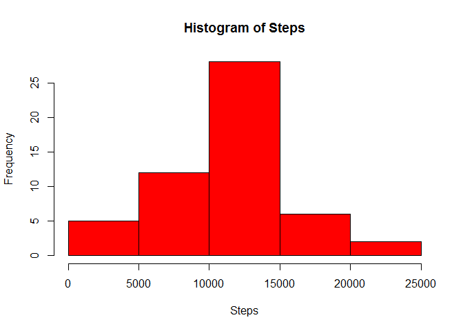
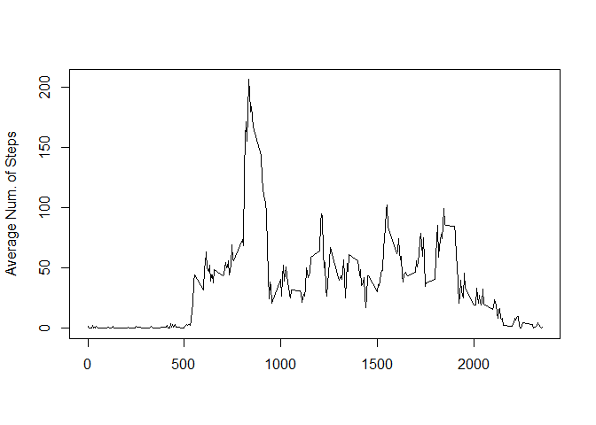
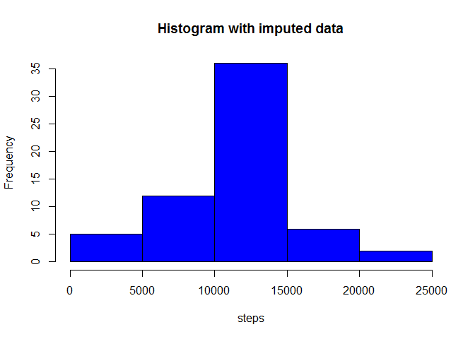
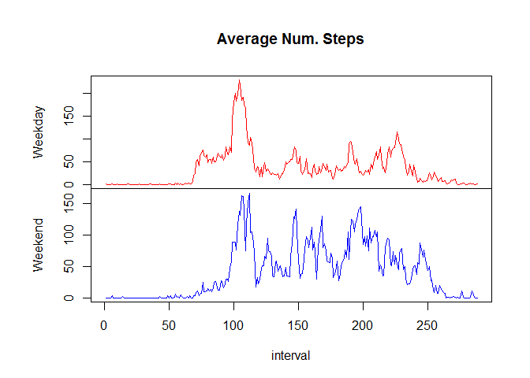

# Peer Assessment 1
WFSalinas  
Thursday, August 13, 2015  

## Loading and preprocessing the data

```r
data = read.csv("activity.csv", header = TRUE)
#Remove NAs
good = complete.cases(data)
df = data[good,]
attach(df)
```

#What is mean total number of steps taken per day?

```r
Steps = sapply(split(steps, date, drop = TRUE), sum)
hist(Steps, col = "red")
```

 

```r
summary(Steps)
```

```
##    Min. 1st Qu.  Median    Mean 3rd Qu.    Max. 
##      41    8841   10760   10770   13290   21190
```

From the above table, the Median and Mean are 10760 and 10770, respectively.


#What is the average daily activity pattern?


```r
AvgPrIntrvl = sapply(split(steps, as.factor(interval), drop = TRUE), mean)
plot(interval[1:288], AvgPrIntrvl, type = "l", xlab = "", ylab = "Average Num. of Steps")
```

 

```r
index = which.max(AvgPrIntrvl)
AvgPrIntrvl[index]
```

```
##      835 
## 206.1698
```
Interval 104 corresponding to time 835 and max value 206.1698113.


##Imputing missing values

Total number of NAS is 2304.

We will use mean for NA replacement.


```r
df.na = data[!good,]
#The averages will be recycled for all NAs
df.na[,1] = replace(df.na$steps, values = AvgPrIntrvl)
data = rbind(df,df.na)
#data set with filled-in NAs
data = data[order(data$date),]
Steps.na = sapply(split(data$steps, data$date, drop = TRUE), sum)
hist(Steps.na, col = "blue", main = "Histogram with imputed data", xlab = "steps")
```

 

```r
summary(Steps.na)
```

```
##    Min. 1st Qu.  Median    Mean 3rd Qu.    Max. 
##      41    9819   10770   10770   12810   21190
```

From the above table, the Median and Mean are 10770 and 10770, respectively. The mean stayed the same but the median changed.

##Are there differences in activity patterns between weekdays and weekends? 


```r
library(chron)
```

```
## Warning: package 'chron' was built under R version 3.1.3
```

```r
dayType = is.weekend(as.Date(data$date))
data = cbind(data,dayType)
df.wkday = subset(data, dayType == 0)
df.wkend = subset(data, dayType == 1)

meanStpsPerDayWkdy = sapply(split(df.wkday$steps, as.factor(df.wkday$interval), drop = TRUE), mean)
meanStpsPerDayWkend = sapply(split(df.wkend$steps, as.factor(df.wkend$interval), drop = TRUE), mean)

par(mfrow=c(2,1), mai = c(0, 1.2, 1, 0.5))
plot(meanStpsPerDayWkdy,type="l", xaxt="n", ylab = "Weekday", main = "Average Num. Steps", col= "red")
par(mai = c(1, 1.2, 0, 0.5))
plot(meanStpsPerDayWkend,type="l", ylab = "Weekend", xlab = "interval", col = "blue")
```

 

```r
par(mfrow=c(1,1))
```
